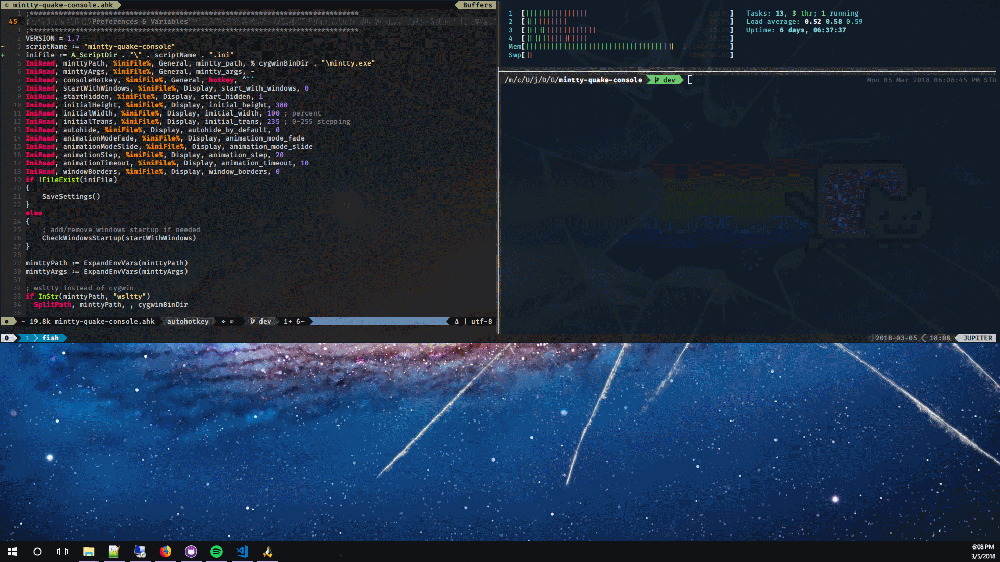

## Requirements

- [mintty](https://github.com/mintty/) (installed through [Cygwin](http://www.cygwin.com), [MSYS](http://www.mingw.org/wiki/MSYS) or [wsltty](https://github.com/mintty/wsltty))

## Usage

[Download latest release](https://github.com/lonepie/mintty-quake-console/releases) and run `mintty-quake-console.exe` **OR**, if you have AutoHotkey installed, clone the repository and run the `mintty-quake-console.ahk` script directly.

**Options:** Right click the mintty-quake-console icon in system tray & select _Options_

Press `Ctrl + ~` (or configured keybinding) to toggle mintty

**Note:** after editing the ini file, reload the script by right-clicking the tray icon and selecting _Reload_

## Screenshot



## Ini/Option Reference

**mintty_path** = path to mintty.exe

**mintty_args** = arguments to pass to mintty.exe

**hotkey** = key combination to show/hide console ([AutoHotkey format](https://www.autohotkey.com/docs/Hotkeys.htm) & [Keylist](https://www.autohotkey.com/docs/KeyList.htm))

**start_with_windows** = add this script to Windows startup (1) or disable (0)

**start_hidden** = show mintty.exe when script is started (0) or wait for hotkey (1)

**initial_height** = height (in pixels) of the mintty console

**initial_width** = width (percentage of screen width) of the mintty console

**initial_trans** = transparency (range from 0 to 255) of the mintty console

**autohide_by_default** = set to 1 to automatically hide mintty when it loses focus

**animation_step** = number of pixels to shift each step of the slide animation

**animation_timeout** = how long (in ms) to wait between each animation_step

**animation_mode_slide** = set to 1 to use sliding animation (up/down)

**animation_mode_fade** = set to 1 to use fading animation (in/out)

**window_borders** = set to 1 to keep window borders & title bar on mintty

## Tips

### Additional Hotkeys

**Ctrl+Alt+Numpad(+)** increase console height

**Ctrl+Alt+Numpad(-)** decrease console height

**Ctrl+Alt+]** increase console width

**Ctrl+Alt+[** decrease console width

**Ctrl+Alt+Numpad(/)** toggle window borders and titlebar

**Ctrl+Alt+Numpad(*)** saves height, width & window borders state

**Ctrl+Alt+Numpad(.)** toggle script

### Use with [wsltty](https://github.com/mintty/wsltty)

Essentially, copy the settings from the shortcut(s) created by wsltty:

```ini
mintty_path=%LOCALAPPDATA%\wsltty\bin\mintty.exe
mintty_args=--WSL= --configdir="%APPDATA%\wsltty" -~
```

#### wsltty non-default shell

Append shell path to `mintty_args`:

```ini
mintty_args=--WSL= --configdir="%APPDATA%\wsltty" -~ /usr/bin/fish -li
```

#### Cygwin non-default shell

To use ZSH instead of BASH, set the following in mintty-quake-console.ini (zsh must be installed through cygwin):

```ini
mintty_args=/bin/zsh -li
```

### Tabs

Use tmux
